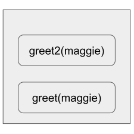

# Exercises

## 3.1

From the following call stack:

---

<b>What information can you give?</b>

> The greet() function has been called with the name maggie

> The greet() function has a nested greet2() function that is currently being called with the name maggie

> Neither greet nor greet2 have finished executing

## 3.2

---

<b>What happens to the stack when your recursive function runs forever?</b>

> Each program has a limited amount of space on the call stack. Each call will continue taking up memory until it runs out, finally exiting with an stack-overflow error.

