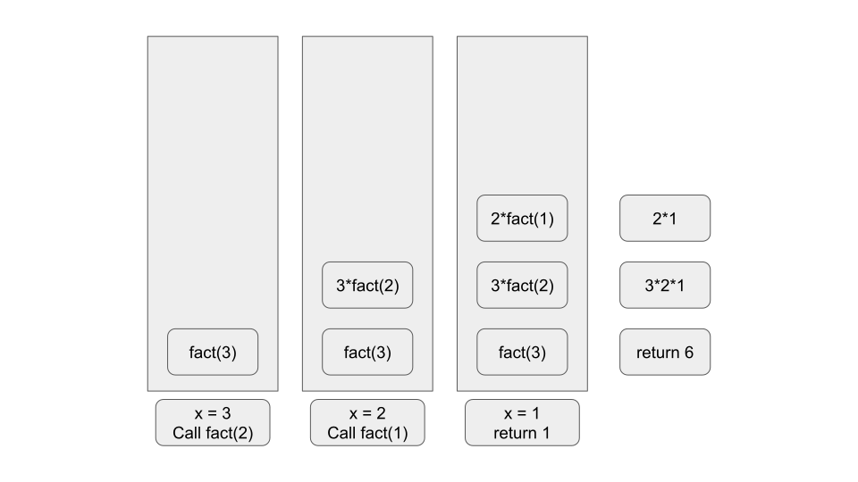

# The Stacks

<details><summary><b>What is a Stack?</b></summary>

> Linear datastructure that follows a LIFO order of operations
</details>

---
<details><summary><b>How do you add and remove items to and from the stack?</b></summary>

> You `PUSH` items to the top of the stack

> You `POP` the topmost item from the stack
</details>

---

## The Call Stack

<details><summary><b>What is the call stack?</b></summary>

> Internal stack that computers use to store all function calls
</details>

---
<details><summary><b>What happens when you call a function from another function?</b></summary>

> The first function is paused in a partially incomplete state
</details>

---
<details><summary><b>What happens to variable values in the stack?</b></summary>

> They remain in memory
</details>

---
<details><summary><b>Are variable values from one function in the stack accesible by other functions in the stack?</b></summary>

> No

> If a copy of a value is sent to another function call in the stack, that function would only have access to that copy
</details>

## Recursive function in the Call Stack

`CODE`
```python
def fact(x):
    if x == 1:
        return 1
    else:
        return x * fact(x-1)

fact(3)
```



